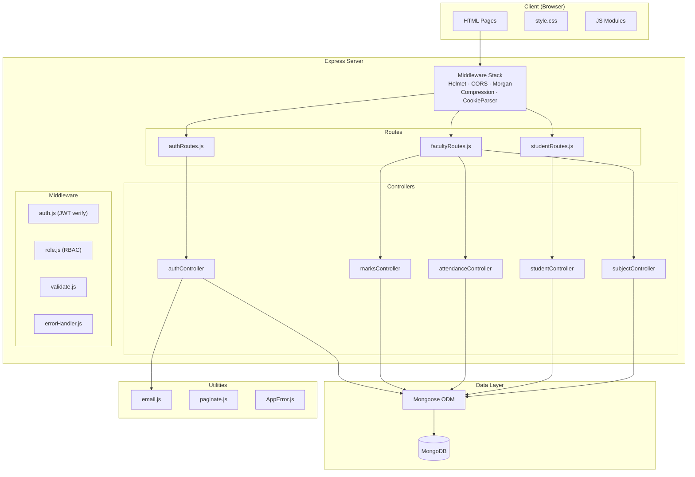
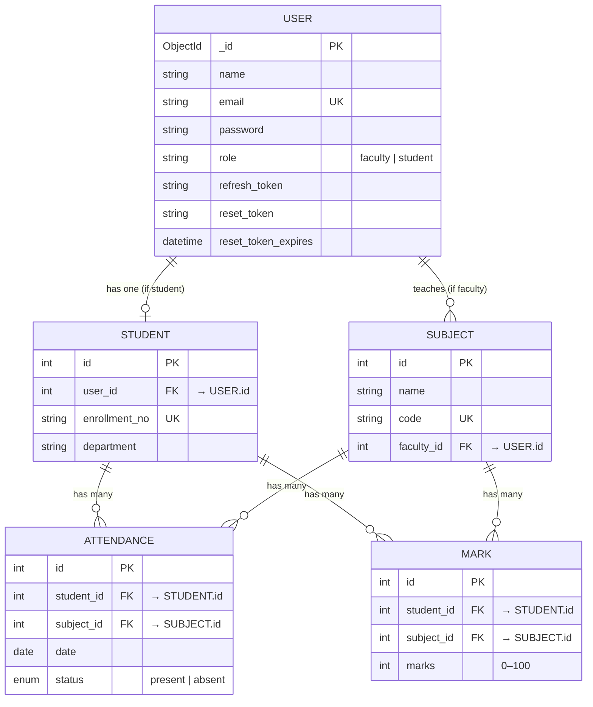

# Student Management System — Project Analysis

## Overview

A Node.js student management system for handling students, subjects, attendance, and marks. It uses an MVC-style structure with a REST API backend and static HTML/CSS/JS frontend.

**Author:** Mayank Shrivastava  
**Runtime:** Node.js ≥ 18 (ES Modules)  
**Database:** MongoDB via Mongoose ODM  

---

## Tech Stack

| Layer | Technology | Purpose |
|-------|-----------|---------|
| **Runtime** | Node.js (ESM) | Server execution |
| **Framework** | Express 4 | HTTP routing & middleware |
| **ODM** | Mongoose 8 | Database abstraction & schemas |
| **Database** | MongoDB | Data persistence |
| **Auth** | JWT (jsonwebtoken) + bcryptjs | Token-based auth & password hashing |
| **Validation** | express-validator | Request body/param validation |
| **Security** | Helmet, CORS, express-rate-limit | HTTP hardening & brute-force protection |
| **Email** | Nodemailer | SMTP-based password reset emails |
| **Logging** | Winston + Morgan | Structured application & HTTP access logs |
| **Compression** | compression | Gzip/Brotli response compression |
| **Frontend** | Vanilla HTML/CSS/JS | Server-rendered static pages |

---

## Architecture



---

## Data Model (Entity Relationships)



**Key constraints:**
- `ATTENDANCE` has a **composite unique index** on `(student_id, subject_id, date)` — one record per student per subject per day
- `MARK` has a **composite unique index** on `(student_id, subject_id)` — one mark per student per subject
- Cascading deletes propagate from `Student` → `Attendance`/`Mark` and from `Subject` → `Attendance`/`Mark`

---

## API Surface

### Authentication (`/api/auth`)

| Method | Endpoint | Auth | Rate Limited | Description |
|--------|----------|------|-------------|-------------|
| POST | `/register` | ❌ | ❌ | Register faculty (requires invite code) or student |
| POST | `/login` | ❌ | ✅ 5/15min | Login with email/password, returns JWT cookies |
| POST | `/refresh` | 🍪 | ❌ | Rotate access token using refresh token |
| POST | `/logout` | 🍪 | ❌ | Clear tokens, invalidate refresh token in DB |
| GET | `/me` | ✅ | ❌ | Get current user profile |
| POST | `/forgot-password` | ❌ | ✅ 3/15min | Generate reset token, send email |
| POST | `/reset-password` | ❌ | ❌ | Reset password with valid token |

### Faculty (`/api/faculty`) — requires `auth + role('faculty')`

| Method | Endpoint | Description |
|--------|----------|-------------|
| GET | `/students` | List all students (paginated) |
| POST | `/subjects` | Create a new subject |
| GET | `/subjects` | List faculty's subjects |
| DELETE | `/subjects/:id` | Delete a subject |
| POST | `/attendance` | Batch mark attendance for a date |
| GET | `/attendance/:subjectId` | View attendance by subject (paginated) |
| POST | `/marks` | Batch add marks for students |
| PUT | `/marks/:id` | Update a single mark record |
| GET | `/marks/:subjectId` | View marks by subject (paginated) |

### Student (`/api/student`) — requires `auth + role('student')`

| Method | Endpoint | Description |
|--------|----------|-------------|
| GET | `/dashboard` | Aggregated overview (attendance %, avg marks) |
| GET | `/attendance` | Personal attendance records (paginated) |
| GET | `/marks` | Personal marks (paginated) |
| GET | `/subjects` | Subjects the student is enrolled in (paginated) |

### System

| Method | Endpoint | Description |
|--------|----------|-------------|
| GET | `/api/health` | Health check with DB connectivity & memory stats |

---

## Security Features

| Feature | Implementation |
|---------|---------------|
| **Password hashing** | bcrypt with 12 salt rounds (Sequelize hooks) |
| **JWT dual-token** | Short-lived access token (15m) + long-lived refresh token (7d) |
| **HttpOnly cookies** | Tokens stored in cookies, not localStorage — immune to XSS theft |
| **Refresh token rotation** | SHA-256 hashed in DB; invalidated on logout/reset |
| **Rate limiting** | Login (5/15min), forgot-password (3/15min) |
| **Helmet** | CSP, X-Frame-Options, HSTS, and other secure headers |
| **Faculty invite code** | Prevents unauthorized privilege escalation |
| **Input validation** | express-validator on all mutating endpoints |
| **Error sanitization** | Stack traces hidden in production; operational vs. programming errors distinguished |
| **Email enumeration prevention** | Forgot-password returns same response whether user exists or not |

---

## Frontend Pages

| Page | File | Purpose |
|------|------|---------|
| Login | `index.html` + `auth.js` | Email/password login form |
| Register | `register.html` + `auth.js` | Registration with role selection |
| Faculty Dashboard | `faculty.html` + `faculty.js` | Subject/attendance/marks management |
| Student Dashboard | `student.html` + `student.js` | View grades, attendance, subjects |
| Forgot Password | `forgot-password.html` + `forgot-password.js` | Request password reset |
| Reset Password | `reset-password.html` + `reset-password.js` | Enter new password with token |

Shared utilities in `common.js` handle API calls, token refresh, and logout.  
Single stylesheet `style.css` (~20 KB) provides the entire UI theme.

---

## Project Structure

```
studentManagementSystem/
├── server.js                  # Entry point — app config, middleware, startup
├── package.json               # Dependencies & scripts
├── .env / .env.example        # Environment configuration
│
├── config/
│   ├── database.js            # Sequelize instance (DATABASE_URL or individual creds)
│   └── logger.js              # Winston logger configuration
│
├── models/
│   ├── index.js               # Model associations hub
│   ├── User.js                # User model with password hashing hooks
│   ├── Student.js             # Student profile model
│   ├── Subject.js             # Subject model
│   ├── Attendance.js          # Attendance model
│   └── Mark.js                # Marks model
│
├── controllers/
│   ├── authController.js      # Register, login, logout, refresh, password reset
│   ├── studentController.js   # Dashboard, attendance, marks, subjects
│   ├── marksController.js     # Add/update/view marks
│   ├── attendanceController.js# Mark/view attendance
│   └── subjectController.js   # Create/list/delete subjects
│
├── middleware/
│   ├── auth.js                # JWT verification middleware
│   ├── role.js                # Role-based access control
│   ├── validate.js            # express-validator result handler
│   └── errorHandler.js        # Centralized error formatting
│
├── routes/
│   ├── authRoutes.js          # Auth endpoints with validation chains
│   ├── facultyRoutes.js       # Faculty-only endpoints
│   └── studentRoutes.js       # Student-only endpoints
│
├── utils/
│   ├── AppError.js            # Custom operational error class
│   ├── email.js               # Nodemailer transport & reset email
│   └── paginate.js            # Reusable pagination helper
│
├── public/
│   ├── index.html             # Login page
│   ├── register.html          # Registration page
│   ├── faculty.html           # Faculty dashboard
│   ├── student.html           # Student dashboard
│   ├── forgot-password.html   # Forgot password page
│   ├── reset-password.html    # Reset password page
│   ├── css/style.css          # Global stylesheet
│   └── js/
│       ├── auth.js            # Login/register logic
│       ├── common.js          # Shared API utilities
│       ├── faculty.js         # Faculty dashboard logic
│       ├── student.js         # Student dashboard logic
│       ├── forgot-password.js # Forgot password logic
│       └── reset-password.js  # Reset password logic
│
└── logs/                      # Winston log output directory
```

---

## Notable Design Patterns

1. **Dual-token authentication** — Access tokens expire fast (15m) for security; refresh tokens (7d) enable seamless session continuity without re-login.

2. **N+1 query elimination** — Marks and attendance controllers batch-fetch students in a single query using `findAll({ where: { id: [...ids] } })` before processing records.

3. **Transaction safety** — Registration wraps `User.create` + `Student.create` in a Sequelize transaction, rolling back both on failure.

4. **Graceful shutdown** — `SIGTERM`/`SIGINT` handlers close the HTTP server and database pool cleanly, with a 10-second forced-exit timeout.

5. **Environment-aware behavior** — Dev mode returns reset tokens in responses; production hides stack traces and requires SMTP for email delivery.

6. **Reusable pagination** — The `paginate()` utility standardizes query param extraction and response metadata across all list endpoints.

---

## Summary Stats

| Metric | Value |
|--------|-------|
| Backend files | ~20 |
| Frontend files | ~12 |
| Dependencies | 14 production + 1 dev |
| API endpoints | ~17 |
| Database tables | 5 |
| Total backend LoC | ~1,100 |
| Total frontend JS LoC | ~850 |
